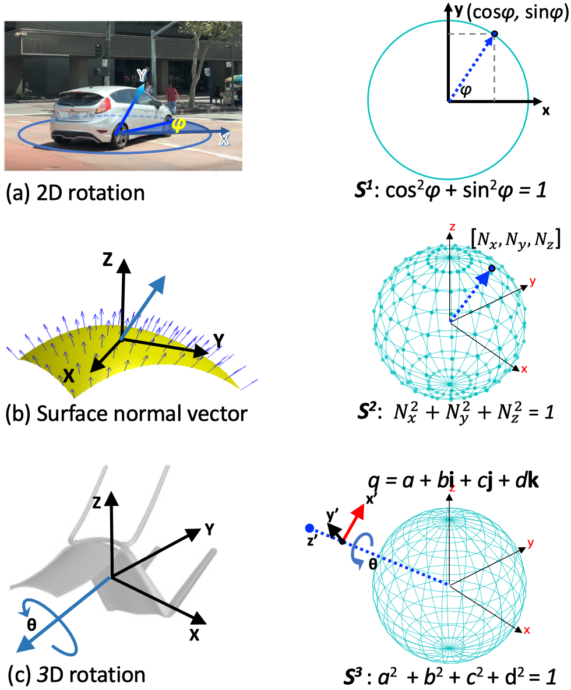
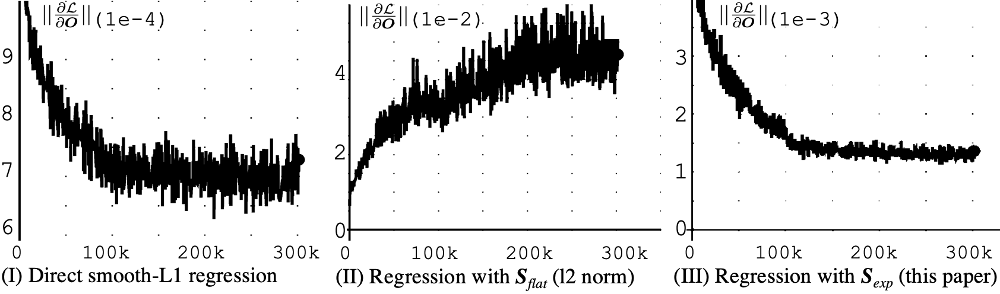
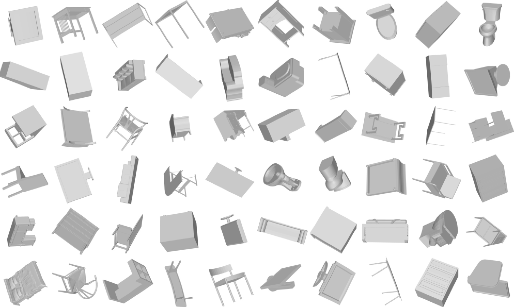
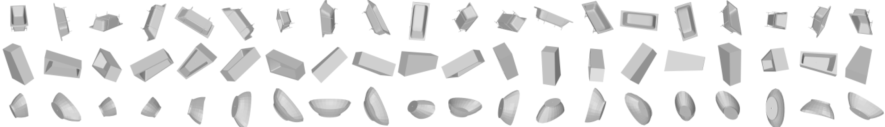

### News

**[Important]**   The evaluation functions for [S1.Viewpoint](S1.Viewpoint/Note.md) and [S3.3D_Rotation](S3.3D_Rotation/Readme.md) are fixed, and so do the reported performance.


------------------------------------

# Spherical Regression

This code contains 3 parts:

|          Task                 |      Code              |           Dataset      |
|-------------------------------|------------------------|------------------------|
| **Viewpoint Estimation**      | [S1.Viewpoint](S1.Viewpoint/Readme.md)           | [Pascal3D+](http://cvgl.stanford.edu/projects/pascal3d.html) |
| **Surface Normal Estimation** | [S2.Surface_Normal](S2.Surface_Normal/Readme.md)     | [NUY-v2](https://cs.nyu.edu/~silberman/datasets/nyu_depth_v2.html), [pbrs](https://github.com/yindaz/surface_normal#data)    |
| **3D Rotation Estimation**    | [S3.3D_Rotation](S3.3D_Rotation/Readme.md)         | [ModelNet10-SO3](#ModelNet10-SO3-Dataset) [new]   |


You can find our CVPR 2019 paper here: [[pdf](http://openaccess.thecvf.com/content_CVPR_2019/papers/Liao_Spherical_Regression_Learning_Viewpoints_Surface_Normals_and_3D_Rotations_on_CVPR_2019_paper.pdf)] [[supp](http://openaccess.thecvf.com/content_CVPR_2019/supplemental/Liao_Spherical_Regression_Learning_CVPR_2019_supplemental.pdf)].

Or the arXiv [[pdf](http://arxiv.org/abs/1904.05404)].


## What is Spherical regression?



Many computer vision problems can be converted into a n-sphere problem.
n-spheres are naturally closed geometric manifolds defined in the
<!---->
%7D) space.
Examples are a) viewpoint estimation (with biternion), b) surface normal estimation, and c) 3D rotation estimation (with quaternion).
This work proposes a general regression framework that can be applied on all these n-sphere problems.

<!-- -->
<!--

## Why use our  regression?

.


-->

## Why use our  regression?


Having gradient constrained, we stablize the training and thus lead better performance.





Variance of the average gradient norm
.
Spherical exponentiation
.
yields lower variance on mini-batch over entire train progress and thus leads to a better performance.


<!--  -->

- (I)    Direct regression with smooth-L1 loss. It may cause the output to no longer follow unit l2 norm.
- (II)   Regression with l2 normalization
.
<!--
.
-->
- (III)  Regression with .
<!--
-->
(this paper).


<br>
<br>
<br>

# ModelNet10-SO3 Dataset

We introduce a new dataset, *ModelNet10-SO3*, composed of images of 3D synthetic renderings. ModelNet10-SO3 is based on [ModelNet10](http://modelnet.cs.princeton.edu), which contains 4,899 instances from 10 categories of 3D CAD models. In ModelNet10 the purpose is the classification of 3D shapes to one of the permissible CAD object categories. With ModelNet10-SO3 we have a different purpose, we want to evaluate 3D shape alignment by predicting its 3D rotation matrix w.r.t the reference position from single image. We construct *ModelNet10-SO3* by uniformly sampling per CAD model 100 3D rotations on SO(3) for the training set and 4 3D rotations for the test set. We render each view with white background, thus the foreground shows the rotated rendering only. The annotation of rotation is in format of quaternion.

### Rendering examples of rotatations.


<br>
<!--  -->


### Example of uniformly sampled views on SO3 (20 views per CAD are shown).


<br>

### Notes
- Image data is stored in lmdb database, and to be read by `pylibs/lmdb_util/imagedata_lmdb.py`
- Annotation of rotation is in quaternion, stored as a python dictionary (`ModelNet10-SO3/viewID2quat.pkl`).
- [Download](https://drive.google.com/file/d/17GLZbNTDq8B_MOgrV1TiJPoqcm_oQ_mK/view?usp=sharing) (2.4G)

#### Visualize the dataset.

```
# Example
python pylibs/lmdb_util/imagedata_lmdb.py  path/to/ModelNet10-SO3/test_20V.Rawjpg.lmdb
```


#### TODO
- Open a discussion page on the correctness of annotations from Pascal3D+, ObjectNet datasets.


## Citation

```
@INPROCEEDINGS{LiaoCVPR19,
  author = {Shuai Liao and Efstratios Gavves and Cees G. M. Snoek},
  title = {Spherical Regression: Learning Viewpoints, Surface Normals and 3D Rotations on n-Spheres},
  booktitle = {Proceedings of the {IEEE} Conference on Computer Vision and Pattern Recognition},
  month = {June},
  year = {2019},
  address = {Long Beach, USA},
  pdf = {http://arxiv.org/abs/1904.05404},
  abstract = { Many computer vision challenges require continuous outputs, but tend to be solved by discrete classification. The reason is classification's natural containment within a probability n-simplex, as defined by the popular softmax activation function. Regular regression lacks such a closed geometry, leading to unstable training and convergence to suboptimal local minima. Starting from this insight we revisit regression in convolutional neural networks. We observe many continuous output problems in computer vision are naturally contained in closed geometrical manifolds, like the Euler angles in viewpoint estimation or the normals in surface normal estimation. A natural framework for posing such continuous output problems are n-spheres, which are naturally closed geometric manifolds defined in the R^{(n+1)} space. By introducing a spherical exponential mapping on n-spheres at the regression output, we obtain well-behaved gradients, leading to stable training. We show how our spherical regression can be utilized for several computer vision challenges, specifically viewpoint estimation, surface normal estimation and 3D rotation estimation. For all these problems our experiments demonstrate the benefit of spherical regression. All paper resources are available at https://github.com/leoshine/Spherical_Regression. }
}
```
