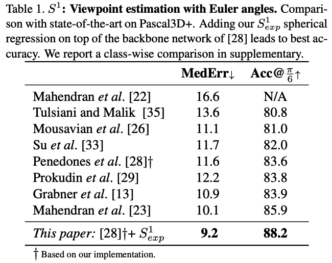

### Update

We find the evaluation function takes a wrong type of matrix norm which result from one of the previous Matlab implementation. Please see the detailed discussion [here](https://github.com/leoshine/Spherical_Regression/issues/8). This means all the distance values are sqrt(2) times smaller than actual ones. Thus the reported performance (Table 1.)  is incorrect.  We apology for this and update the performance here.


- *The previously reported performance:*



- Partially updated version:

<center><b>A few updates for Table1.</b></center>

|                           | MedErr                                           | Acc@pi/6                                         | comment                                                      |
| ------------------------- | ------------------------------------------------ | ------------------------------------------------ | ------------------------------------------------------------ |
| Mahendran et al. [22]     | 16.6                                             | N/A                                              | # code is not available                                      |
| Tulsiani and Malik [35]   | 13.6                                             | 80.8                                             | # [seems correct](https://github.com/shubhtuls/ViewpointsAndKeypoints/blob/1d57050601f4a3f7842b2953be524f47d4f53b36/evaluate/evaluatePredictionError.m) |
| Mousavian et al. [26]     | 11.1                                             | 81.0                                             | # [correct](https://github.com/geopavlakos/object3d/blob/master/code/pascal3d_res.m) |
| Su et al. [33]            | <span style='color:red'>***11.7***    (?)</span> | <span style='color:red'>***82.0***    (?)</span> | # [[seems incorrect]](https://github.com/ShapeNet/RenderForCNN/blob/c0bee04aad3dc2f0ae5de71daf6d51664ce02e76/view_estimation/compute_vp_acc_mederror.m#L16) |
| Penedones et al. [28]†    | ~~**11.6**~~   16.4                              | ~~**83.6**~~   77.8                              | # [fixed](https://github.com/leoshine/Spherical_Regression/commit/4fce2986600b4739fffbfa7501f18a47abe095e3) |
| Prokudin et al. [29]      | <span style='color:red'>***12.2***    (?)</span> | <span style='color:red'>***83.8***    (?)</span> | # [[seems incorrect]](https://github.com/sergeyprokudin/deep_direct_stat/blob/master/view_estimation/compute_vp_acc_mederror.m) (same as [33]) |
| Grabner et al. [13]       | 10.9                                             | 83.9                                             | # code is not available                                      |
| Mahendran et al. [23]     | 10.1                                             | 85.9                                             | # [correct ](https://github.com/JHUVisionLab/multi-modal-regression/blob/master/evaluateGeodesicBDModel_quaternion.py) |
| This paper: [28]†+ S1_exp | ~~**9.2**~~   13.0                               | ~~**88.2**~~   83.4                              | # [fixed](https://github.com/leoshine/Spherical_Regression/commit/4fce2986600b4739fffbfa7501f18a47abe095e3) |


Correspondingly, the update per category evaluation for Penedones et al. [28] and this paper is as following:

<center><b>A few updates for Table 2 in supplementary materials.</b></center>

```
# -------------------   For "Penedones et al. [28]†" -------------------- 

                MedError       Acc@pi/6     Acc@pi/12     Acc@pi/24
aeroplane         17.397         70.652        41.304        11.957
bicycle           16.280         76.271        45.763        11.017
boat              44.198         36.066        15.164         2.869
bottle             9.700         94.841        73.810        36.111
bus                6.168         93.506        88.312        62.338
car               10.023         87.742        69.355        38.065
chair             17.198         73.279        42.510        13.360
diningtable       19.609         69.565        47.826        13.043
motorbike         18.594         76.642        33.577         5.109
sofa              10.866         95.000        70.000        25.000
train              9.844         80.531        66.372        37.168
tvmonitor         17.152         79.730        43.243        18.018
MEAN              16.419         77.819        53.103        22.838


# --------------------    For "This paper: [28]†+ S1_exp" -----------------

                MedError       Acc@pi/6     Acc@pi/12     Acc@pi/24   
aeroplane         12.978         82.971        58.696        22.101  
bicycle           16.343         79.661        44.915        12.712  
boat              29.142         50.820        28.689        11.475  
bottle            10.365         94.841        73.413        34.127  
bus                4.773         96.753        92.857        79.870  
car                6.786         92.258        81.290        57.097  
chair             11.660         87.449        66.802        26.721  
diningtable       12.058         73.913        60.870        30.435  
motorbike         17.078         82.482        43.796        10.219  
sofa              12.239         90.000        80.000        27.500  
train              8.604         82.301        72.566        42.478  
tvmonitor         14.338         86.937        53.153        20.270  
MEAN              13.030         83.366        63.087        31.250 

```


Please correct me if I am mistaken anything.

