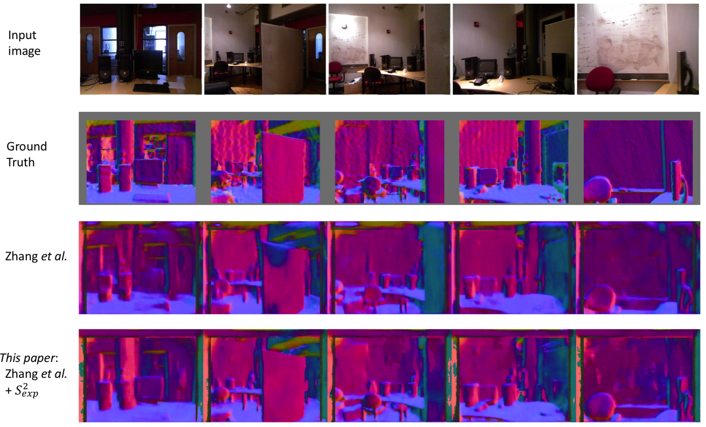

## Note:

This is the Pytorch implementation of [Zhang et al. CVPR17], which originally was written in torch.

**Please read through [this instruction](..//dataset/SurfaceNormal/download_url.md) carefully on datasets preparation.**

We follow the same training setup as [Zhang et al. CVPR17], that is we first pre-train on the selected 568K synthetic data provided by [Zhang et al. CVPR17] for 8 epochs, and fine-tune on NYU v2 for 60 epochs.


```bash

# Change path to the "reg_Sexp" folder, and program
# will automatically authmatically parse the path to
# figure out the Spherical regression module ("Sexp") 
# should be used.
cd regNormalNet/reg_Sexp


# If you want to test the flat regression version,
# ie [Zhang et al. CVPR17], then you need to path
# change as following:
#  cd regNormalNet/reg_Sflat


# Use GPU 0,1 to train.
export GPUs=0,1

# Pretrain on pbrs synthetic data for 8 epoches.
bash ../trainval.sh  $GPUs  pretrained_on_pbrs  \
   --sample_nyu=0.00  --sample_syn=1.00         \
   --nr_epoch=8 --snapshot_step_epoch=2

# Wait the above to finish, and in the snapshots dir
# there should be the pretrained weights files.
# "regNormalNet/reg_Sexp/snapshots/vgg16se.N0.00_S1.00.pretrained_on_pbrs"


# Fne-tune on NYU v2 for 60 epochs.
bash ../trainval.sh  $GPUs  fine_tune_on_nyu   \
  --sample_nyu=1.00  --sample_syn=0.00         \ 
  --nr_epoch=60 --snapshot_step_epoch=10       \
  --pretrain=snapshots/vgg16se.N0.00_S1.00.pretrained_on_pbrs
```

<br>
<br>
## Result visualization

<br>
<br>


### Reference

[Zhang et al. CVPR17] Physically-based rendering for indoor scene understanding using convolutional neural networks.