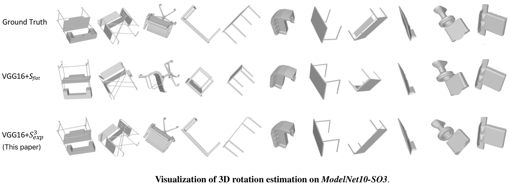

### Let's check some results visualization first ...


<br>
<br>

**Please read through [this instruction](../dataset/ModelNet10-SO3/Readme.md) on datasets preparation.**

### Usage

```bash
# We already made this folder for you.
# The model and result will be stored here.
cd S3.3D_Rotation/regQuatNet/reg_Sexp

# e.g. bash ../trainval.sh  {NetArch}  {GPU_IDs}
bash ../trainval.sh  alexnet  0

```


### Check result.

```bash
cat {work_dir}/temp.out_eval_path.txt
```


<br>
<br>
