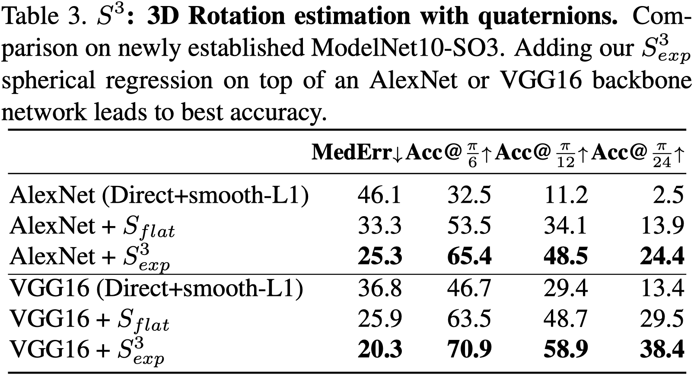

### Update:


We find the evaluation function takes a wrong type of matrix norm which result from one of the previous Matlab implementation. Please see the detailed discussion [here](https://github.com/leoshine/Spherical_Regression/issues/8). This means all the distance values are sqrt(2) times smaller than actual ones. Thus the reported performance (Table 3.) in the paper is incorrect. 
We apology for this and update the performance here.

* *The previously reported performance:*

 

* *The update perform is as following:*

|                            |      MedErr |  Acc@pi/6  | Acc@pi/12 | Acc@pi/24 |
|----------------------------|-------------|------------|-----------|-----------|
| AlexNet (Direct+smooth-L1) |     -       |     -      |     -     |     -     |
| AlexNet (S_flat)           |    47.5     |    44.5    |    23.5   |   6.8     |
| AlexNet (S_exp)            |    41.9     |    51.4    |    28.8   |   8.9     |
| VGG16   (Direct+smooth-L1) |     -       |     -      |     -     |     -     |
| VGG16   (S_flat)           |    37.8     |    54.9    |    38.2   |   16.6    |
| VGG16   (S_exp)            |    28.7     |    65.8    |    49.6   |   25.2    |


[TODO] "-" to be updated.


<br>
<br>

----------------
### Let's check some results visualization first ...


<br>
<br>


**Please read through [this instruction](../dataset/ModelNet10-SO3/Readme.md) on datasets preparation.**

### Usage

```bash
# We already made this folder for you.
# The model and result will be stored here.
cd S3.3D_Rotation/regQuatNet/reg_Sexp

# e.g. bash ../trainval.sh  {NetArch}  {GPU_IDs}
bash ../trainval.sh  alexnet  0

```


### Check result.

```bash
cat {work_dir}/temp.out_eval_path.txt
```


<br>
<br>
