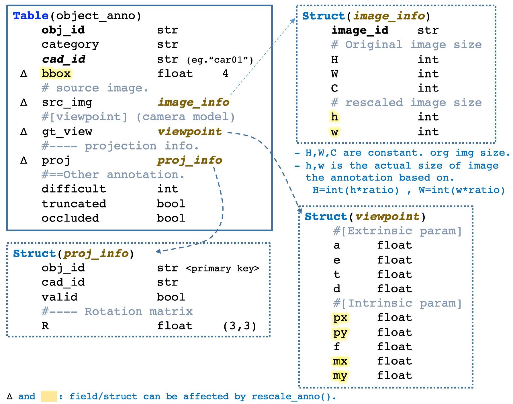

# Prepare dataset

```bash
# Go to {code_root}/dataset/Pascal3D
cd  dataset/Pascal3D
```

## 1) Download datasets.


### Get Pascal3D+ dataset.

Download Pascal3D+ from [this webpage](http://cvgl.stanford.edu/projects/pascal3d.html).
Since we only need image data and annotations, you can choose this one [release1.1 ~ 7.5GB](ftp://cs.stanford.edu/cs/cvgl/PASCAL3D+_release1.1.zip).

```bash
mkdir download.cache

wget ftp://cs.stanford.edu/cs/cvgl/PASCAL3D+_release1.1.zip  -P download.cache/
# unzip
cd download.cache/
unzip PASCAL3D+_release1.1.zip
cd ..
```

### Get the synthetic data from "Render for CNN".

```bash
wget https://shapenet.cs.stanford.edu/media/syn_images_cropped_bkg_overlaid.tar  -P download.cache/
# untar
cd  download.cache/
tar xvf syn_images_cropped_bkg_overlaid.tar
cd  ..
```


### Adjust your configuration paths at:

~/working/cvpr19regpose/code.release/dataset/Pascal3D/download.cache

```yaml
# config.yml
Pascal3D_release_root  : ../download.cache/PASCAL3D+_release1.1  
Synthetic_Images_root  : ../download.cache/syn_images_cropped_bkg_overlaid
```


## 2) Build up python datebase for Pascal3D+. 

Run 

```bash
cd    prepare_data
bash  prepare_Pascal3D.sh
```

- This script will first call ```python mat2py.py``` to dump matlab annotation '.mat' (from Pascal3D+) to python pickle '.pkl'.
- Then, ```prepare_anno_db.py``` will build up python annotation db table with data struture specified as following.
- Create lmdb for image data storage by ```python build_imdb.py```.


### The data structure for annotation record.

**obj_id**. We assign per instance (a.k.a object) across the images with an object identifier, with the format {image_id}_{x1},{y1},{x2},{y2} where the (x1,y1,x2,y2) is the bounding box annotation on original images.

**object_anno** (a.k.a rcobj) is a data structure stores the annotation per object. The visualization of such data structure is as following:




The python definition is implemented in 
```Pascal3D/anno_db_v2/db_type.py```


## 3) Build up python datebase for synthetic data. 

```bash
bash prepare_r4cnn.sh
```

This will 

- build up lmdb for synthetic image storage.
- build up annotation db.

